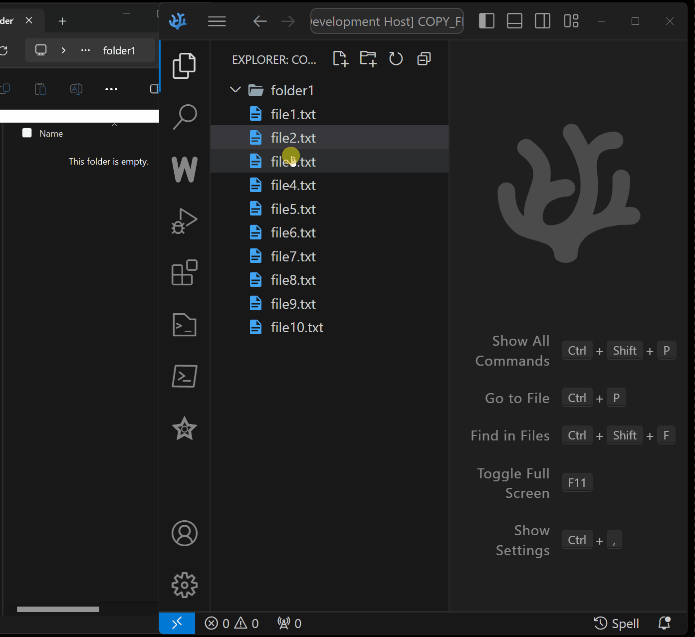

# Amathron Copy File To Clipboard (Windows) Context Menu

## Features

- Copies items - file(s) and/or folder(s) - into windows clipboard as you would use COPY function in the windows explorer on a file.

## Demo

## Requirements

- PowerShell execution must be enabled. This should be the case for most developers working on windows.

## Release Notes

### 1.0.0

Initial release.

